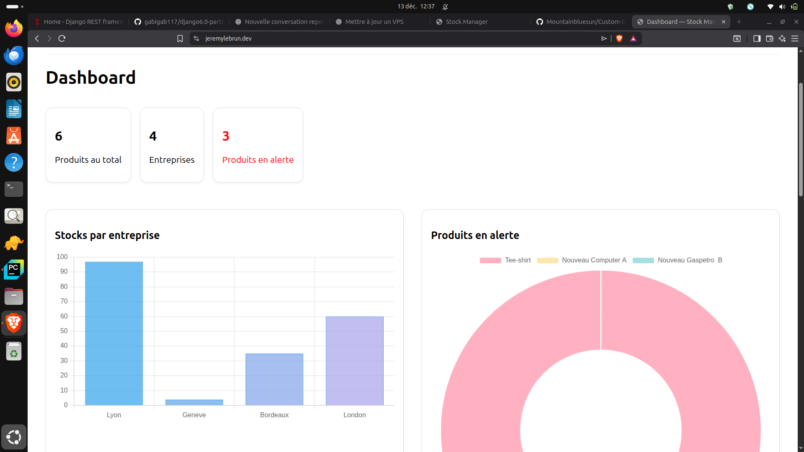
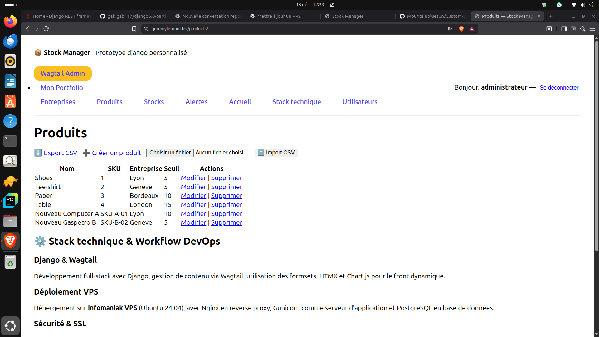
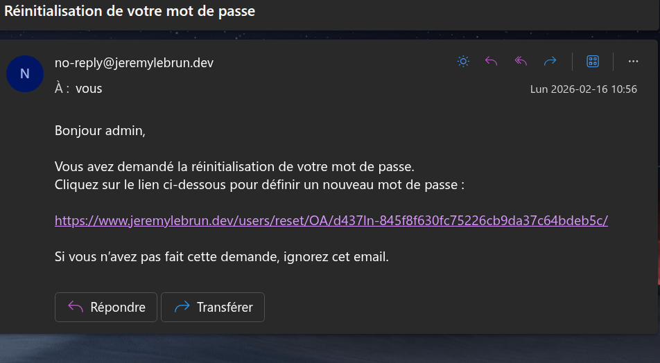

Custom Django Prototype - Stock Manager
Prototype Django full-stack pour la gestion de stock multi-entreprises, développé comme projet de démonstration technique et vitrine de compétences DevOps.

🔗 Site en production : https://www.jeremylebrun.dev
Site en évolution continue (CI/CD)

🚀 Actualité du Projet (Avril 2026)
Le projet a récemment fait l'objet d'une migration d'infrastructure majeure :

Nouvel Hébergement : Passage sur un VPS sous Ubuntu 24.04.

Serveur Web : Configuration optimisée de Nginx et Gunicorn.

Expérience Utilisateur : Mise en place d'une gestion personnalisée des erreurs (Pages 404/500) pour une navigation fluide en mode production (DEBUG=False).

Sécurité : Gestion rigoureuse des variables d'environnement (.env) et des accès SSH par clés.

🛠️ Stack Technique
Framework : Django 5.x

CMS : Intégration de Wagtail pour la gestion de contenu.

Base de données : PostgreSQL (Production) / SQLite (Développement).

Frontend : Templates Django, Intégration de projets externes (Laravel).

DevOps : Git, Gunicorn, Nginx, Linux (Ubuntu).

📋 Fonctionnalités clés
Multi-entreprises : Gestion cloisonnée des stocks par entité.

Dashboard : Vue d'ensemble des indicateurs de performance.

Système d'Alertes : Notification en cas de stock critique.

Portfolio Intégré : Zone dédiée à la présentation d'autres projets techniques.
## 📸 Screenshots

### Dashboard (environnement Linux)

### Gestion des produits

### Test successful token

🛠 Stack

Python 3

Django 5

PostgreSQL

HTMX

Chart.js

Gunicorn

Nginx

Ubuntu 24.04 (VPS)

✨ Fonctionnalités

Authentification utilisateur

Gestion multi-entreprises / multi-sites

Produits et stocks par site

Mouvements de stock (entrée / sortie)

Dashboard avec indicateurs et graphiques

Interface dynamique avec HTMX

🗂 Modèle de données (simplifié)

Product

Location

Stock (Product × Location)

Movement (IN / OUT)

🚀 Installation (local)
git clone https://github.com/Mountainbluesun/Custom-Django-Prototype.git
cd Custom-Django-Prototype
python -m venv venv
source venv/bin/activate
pip install -r requirements.txt
python manage.py migrate
python manage.py createsuperuser
python manage.py runserver

🧪 Tests & Validation
Tests unitaires avec pytest.

Script de validation SMTP dédié (test_mail.py) pour vérifier la connectivité en production.

[!IMPORTANT]
Fichiers de secours (.stable) :
Les fichiers settings.py.stable et urls.py.stable sont des sauvegardes de configurations de production stables. Ils sont conservés à titre de référence et ne sont pas utilisés par Django au runtime.

🌐 Déploiement & Communication

- Serveur : Déploiement manuel sur VPS Ubuntu 24.04 (Gunicorn + Nginx en reverse proxy).
- Sécurité : HTTPS (Let’s Encrypt), Pare-feu UFW, isolation de la base PostgreSQL.
- Anti-Spam : Intégration de Captcha sur les formulaires publics.
- UX : Gestion des erreurs de routage avec des templates 404 personnalisés.
- Emails : Configuration SMTP professionnelle (Infomaniak) avec gestion des files d'attente pour les notifications et la récupération de mot de passe.
- Variables : Gestion des secrets via .env (non versionné).

🔐 Sécurité

DEBUG = False en production

HTTPS obligatoire

Accès base de données local uniquement

Pare-feu UFW

## Configuration backups

The files below are intentional backups of stable production configurations:

- `src/config/settings.py.stable`
- `src/config/urls.py.stable`

They were created before production routing changes related to Nginx and
the portfolio project page integration.

These files are **not used by Django at runtime** and are kept only
for reference and rollback purposes.

