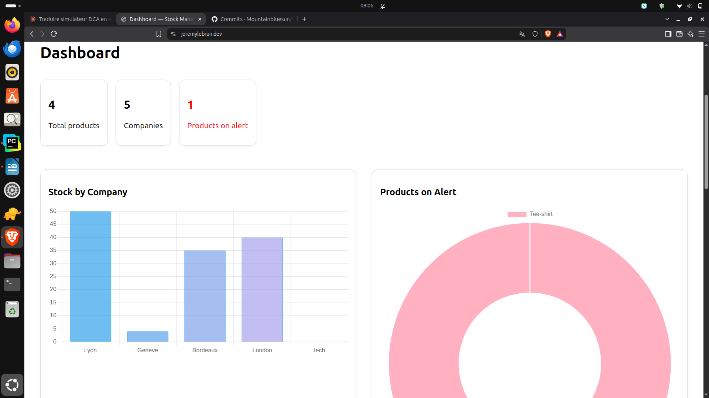
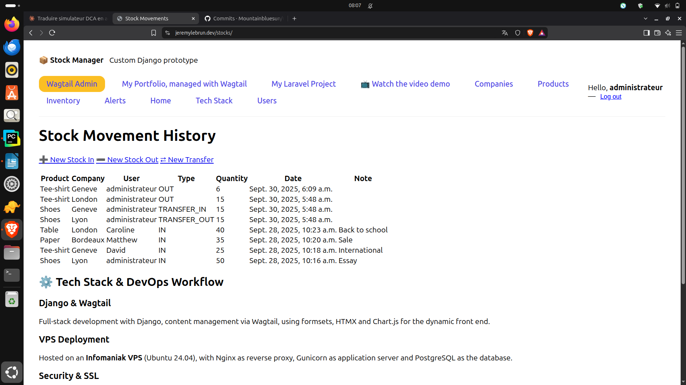
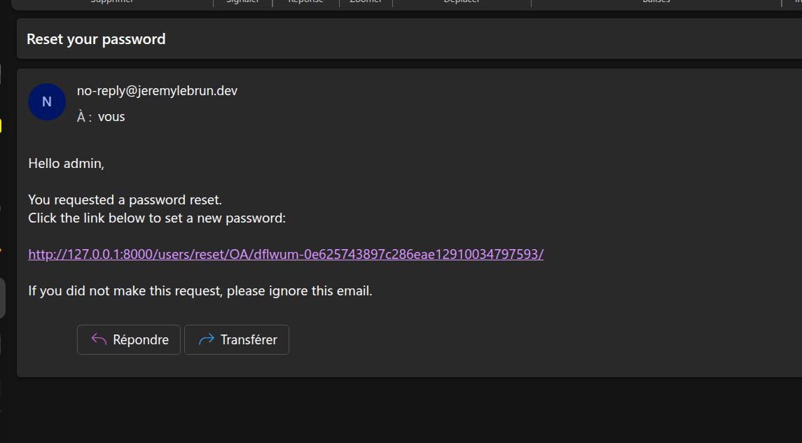

Custom Django Prototype - Stock Manager
Full-stack Django prototype for multi-company stock management, built as a technical demo project and DevOps skills showcase.

🔗 Live site: https://www.jeremylebrun.dev
Site under continuous improvement (CI/CD)

🚀 Project News (April 2026)
The project recently went through a major infrastructure migration:

New Hosting: Moved to a VPS running Ubuntu 24.04.

Web Server: Optimized Nginx and Gunicorn configuration.

User Experience: Custom error handling (404/500 pages) for smooth navigation in production mode (DEBUG=False).

Security: Rigorous management of environment variables (.env) and SSH key-based access.

### 🎥 Media & Streaming (April 2026)
The infrastructure was updated to support high-performance video streaming:
- **Nginx Optimization:** Configured `Accept-Ranges` support to allow seeking (moving the playback bar) without reloading the entire video.
- **Mime-Types:** Explicit MIME type handling (`video/mp4`) at both the Django and web server level for cross-browser compatibility.
- **Media Security:** Strict separation between static files (design assets) and media files (uploads/content), served in isolation for better performance.

- 🛠️ Tech Stack
Framework: Django 5.x

CMS: Wagtail integration for content management.

Database: PostgreSQL (Production) / SQLite (Development).

Frontend: Django templates, integration of external projects (Laravel).

DevOps: Git, Gunicorn, Nginx, Linux (Ubuntu).

📋 Key Features
Multi-company: Siloed stock management per entity.

Dashboard: Overview of key performance indicators.

Alert System: Notifications when stock is critically low.

Integrated Portfolio: Dedicated area for showcasing other technical projects.
## 📸 Screenshots

### Dashboard (Linux environment)

### Stock Movement History

### Test successful token

🛠 Stack

Python 3

Django 5

PostgreSQL

HTMX

Chart.js

Gunicorn

Nginx

Ubuntu 24.04 (VPS)

✨ Features

User authentication

Multi-company / multi-site management

Products and stock per site

Stock movements (in / out)

Dashboard with metrics and charts

Dynamic interface with HTMX

🗂 Data Model (simplified)

Product

Location

Stock (Product × Location)

Movement (IN / OUT)

🚀 Installation (local)
git clone https://github.com/Mountainbluesun/Custom-Django-Prototype.git
cd Custom-Django-Prototype
python -m venv venv
source venv/bin/activate
pip install -r requirements.txt
python manage.py migrate
python manage.py createsuperuser
python manage.py runserver

🧪 Tests & Validation
Unit tests with pytest.

Dedicated SMTP validation script (test_mail.py) to verify connectivity in production.

[!IMPORTANT]
Configuration backups (`.stable` files):
The files `src/config/settings.py.stable` and `src/config/urls.py.stable` are intentional backups of stable production configurations. They were created before production routing changes related to Nginx and the portfolio project page integration. They are kept for reference and rollback purposes only, and are **not used by Django at runtime**.

🌐 Deployment & Communication

- Server: Manual deployment on a Ubuntu 24.04 VPS (Gunicorn + Nginx as reverse proxy).
- Security: HTTPS (Let's Encrypt), UFW firewall, isolated PostgreSQL database.
- Anti-Spam: Captcha integration on public forms.
- UX: Custom 404 templates for routing error handling.
- Emails: Professional SMTP setup (Infomaniak) with queued delivery for notifications and password recovery.
- Variables: Secrets managed via .env (not version-controlled).

🔐 Security

DEBUG = False in production

HTTPS required

Local-only database access

UFW firewall